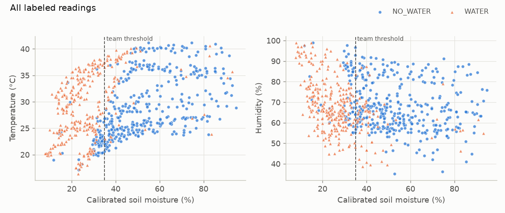
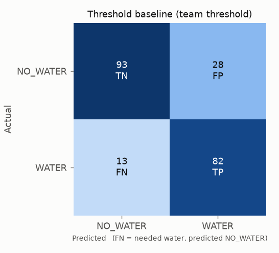
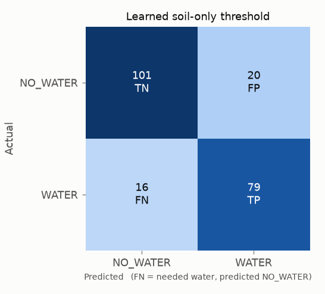
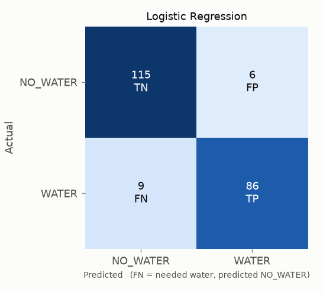
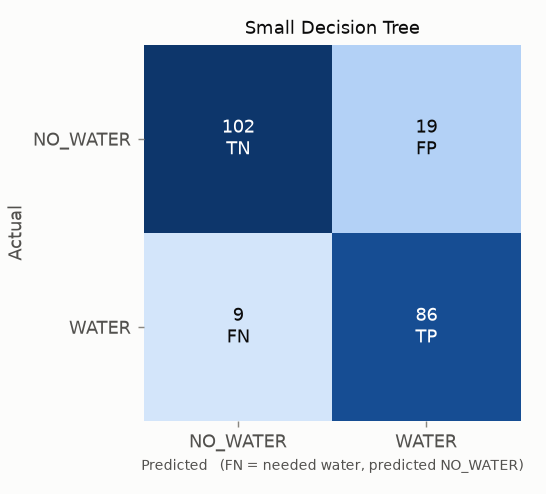
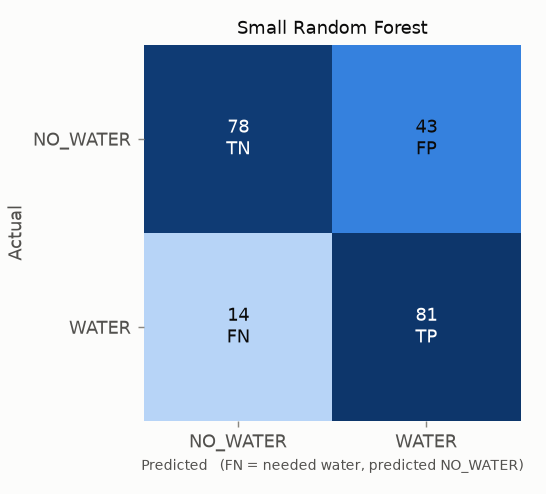
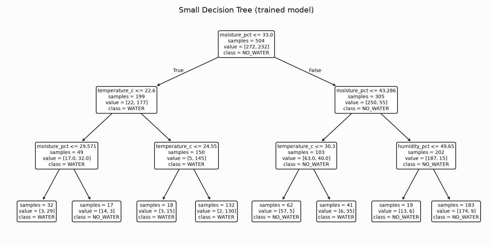

# Model Report

Generated automatically by `python -m src.evaluate` on 2026-10-02T10:42:08. Every number below comes from that run.

## 1. Dataset summary

| Item | Value |
|---|---|
| Data kind | REAL |
| Files | 10 |
| Rows loaded | 720 |
| Rows kept after cleaning | 720 |
| Collection sessions | 10 |
| Time range | 2025-03-01 14:00:00 → 2025-03-20 02:50:00 |
| Class distribution | WATER 327, NO_WATER 393 |
| Label sources | manual: 720 |

## 2. Preprocessing

- Non-numeric/missing sensor values, impossible values (soil_raw outside 0–1023, temperature/humidity outside the configured ranges), duplicates and unlabeled rows are dropped.
- Soil calibration: `soil_raw_dry = 620` → 0 %, `soil_raw_wet = 270` → 100 %, linear in between, clipped to 0–100 %, computed in 32-bit float (same as the Arduino).
- Model features, in order: `moisture_pct, temperature_c, humidity_pct`. Timestamp, plant ID, session ID and soil condition text are **not** used as features.
- Logistic Regression uses standard scaling (folded into the weights on export); trees need no scaling.

## 3. Train/test split

- Strategy: **group** (whole sessions go to either train or test, so correlated readings from one session cannot leak across).
- Training set: 504 rows, 7 session(s), WATER 232 / NO_WATER 272
- Test set: 216 rows, 3 session(s), WATER 95 / NO_WATER 121
- Test sessions: session_01, session_04, session_07

## 4. Baseline

`WATER if moisture_pct < 35.0 else NO_WATER`. The threshold is the team's configured value and is never fitted to data.

## 5. Models tested

| Model | What it is |
|---|---|
| Learned soil-only threshold | depth-1 tree on soil moisture only: shows whether ML gains come from temperature/humidity or just from a different threshold |
| Logistic Regression | linear model on all 3 features, C=1.0 |
| Small Decision Tree | {'max_depth': 3, 'min_samples_leaf': 5} |
| Small Random Forest | {'n_estimators': 10, 'max_depth': 3, 'min_samples_leaf': 5} |

## 6. Cross-validation (training set only)

Method: 5-fold StratifiedGroupKFold (whole sessions held out per fold)

| Model | Accuracy | Precision | Recall | F1 | F2 | Total FN |
|---|---:|---:|---:|---:|---:|---:|
| Threshold baseline (team threshold) | 0.832 ± 0.073 | 0.814 ± 0.239 | 0.695 ± 0.277 | 0.680 ± 0.262 | 0.681 ± 0.270 | 50 |
| Learned soil-only threshold | 0.764 ± 0.101 | 0.615 ± 0.412 | 0.601 ± 0.304 | 0.567 ± 0.332 | 0.569 ± 0.297 | 72 |
| Logistic Regression | 0.899 ± 0.041 | 0.823 ± 0.193 | 0.872 ± 0.096 | 0.836 ± 0.130 | 0.854 ± 0.100 | 28 |
| Small Decision Tree | 0.786 ± 0.108 | 0.627 ± 0.349 | 0.600 ± 0.305 | 0.609 ± 0.321 | 0.603 ± 0.310 | 66 |
| Small Random Forest | 0.764 ± 0.095 | 0.667 ± 0.313 | 0.622 ± 0.264 | 0.602 ± 0.285 | 0.599 ± 0.263 | 74 |

## 7. Held-out test metrics

Positive class = WATER. A **false negative** = the plant needed water but the model said NO_WATER.

| Model | Accuracy | Precision | Recall | F1 | FN | FP | Embedded suitability |
|---|---:|---:|---:|---:|---:|---:|---|
| Threshold baseline (team threshold) | 0.810 | 0.745 | 0.863 | 0.800 | 13 | 28 | High (one comparison) |
| Learned soil-only threshold | 0.833 | 0.798 | 0.832 | 0.814 | 16 | 20 | Very High (one comparison) |
| Logistic Regression ✔ selected | 0.931 | 0.935 | 0.905 | 0.920 | 9 | 6 | High (3 multiply-adds) |
| Small Decision Tree | 0.870 | 0.819 | 0.905 | 0.860 | 9 | 19 | Very High (nested if statements) |
| Small Random Forest | 0.736 | 0.653 | 0.853 | 0.740 | 14 | 43 | Medium (several trees; not exported) |

## 8. Confusion matrices (test set)

| Model | TN | FP | FN | TP | Missed-watering rate (FN / actual WATER) |
|---|---:|---:|---:|---:|---:|
| Threshold baseline (team threshold) | 93 | 28 | 13 | 82 | 0.137 |
| Learned soil-only threshold | 101 | 20 | 16 | 79 | 0.168 |
| Logistic Regression | 115 | 6 | 9 | 86 | 0.095 |
| Small Decision Tree | 102 | 19 | 9 | 86 | 0.095 |
| Small Random Forest | 78 | 43 | 14 | 81 | 0.147 |

## 9. Selected model

**Logistic Regression**. Highest mean CV F2 (0.854).

The choice was made from cross-validation on the training set before the test set was scored.

### Does ML beat the baseline?

On the 216-row held-out test set, the selected model (Logistic Regression) has F1 0.920 vs 0.800 for the baseline, recall 0.905 vs 0.863, and 9 vs 13 false negatives. It improves on the baseline on this test set. With one test split and correlated readings, treat this as a hint that needs confirmation with more sessions, not as proof.

## 10. Embedded deployment notes

- Export with `python -m src.export_embedded`. It writes a C header with the calibration and the model as plain `if` statements (tree) or three multiply-adds (logistic regression), then compiles it with g++ and checks it against the Python model on every train/test row plus random inputs.
- The Random Forest is not exported: several trees would fit in an Uno's flash, but it is harder to check and explain.
- The Arduino must average the soil sensor exactly like `sensor_logger.ino`, because that is how the training data was produced.

## 11. Limitations

- Single train/test split of 216 rows; test metrics have wide uncertainty.
- Readings within a session are correlated, so the effective sample size is closer to the number of sessions than the number of rows.
- Labels are only as good as the team's labeling procedure; if labels come from the threshold rule, the baseline is correct by construction.
- One sensor, one pot/soil type: the model is not expected to transfer to other soils or plants without recalibration and new data.
- DHT11 resolution is coarse (±2 °C, ±5 % RH), which limits what temperature/humidity can add.
